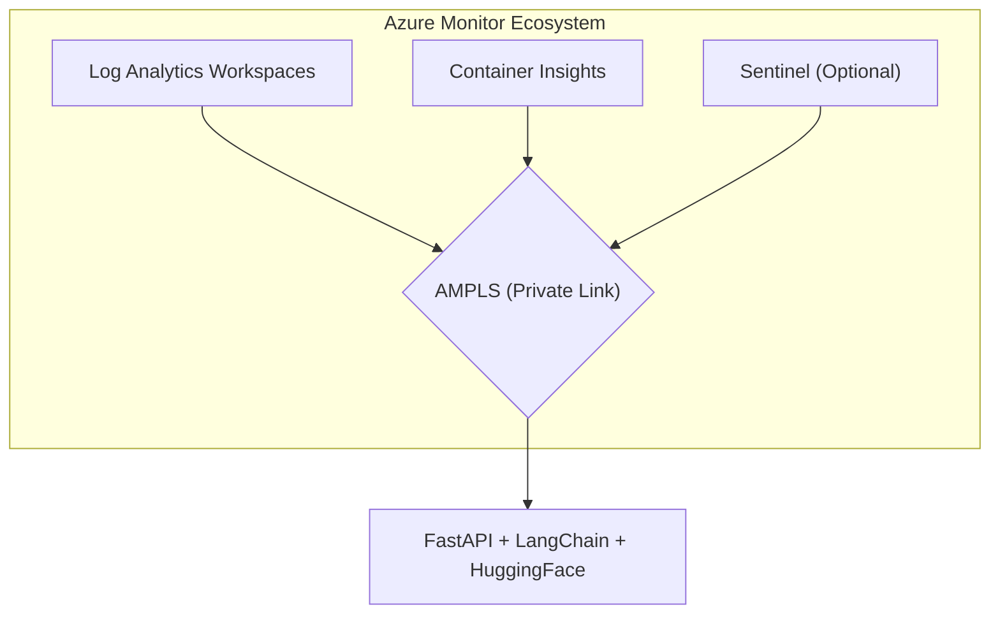

# 🤖 AI-Powered Azure Log Analytics

[](https://opensource.org/licenses/MIT)
[](https://www.python.org/downloads/)
[](https://www.terraform.io/)
[](https://azure.microsoft.com/)

> **Overview:** An enterprise-grade, AI-powered log analytics solution for Azure infrastructure. This project enhances Azure Monitor, Log Analytics Workspaces, and AMPLS with machine learning capabilities to provide automated insights, natural language querying, and predictive incident analysis.

---

## 🎯 Enterprise Features

### ☁️ Core Cloud Capabilities
* ✅ **Multi-Workspace Aggregation:** Seamlessly query across multiple Log Analytics workspaces.
* ✅ **AMPLS Integration:** Strict private network connectivity utilizing Azure Monitor Private Link Scope.
* ✅ **OS-Level Monitoring:** Comprehensive ingestion of Windows Event Logs, Syslog, and Performance Counters.
* ✅ **Container Insights:** Deep observability into AKS pod logs, metrics, and cluster health.
* ✅ **Azure Service Logs:** Native integration with Activity Logs, Diagnostic Settings, and Resource Logs.

### 🧠 AI & Machine Learning
* 🤖 **Natural Language to KQL:** Convert plain English questions directly into executable KQL queries.
* 🔍 **Root Cause Analysis:** AI-powered incident investigation and error summarization.
* 📊 **Anomaly Detection:** Machine learning-based statistical anomaly detection for time-series metrics.
* 🎯 **Pattern Recognition:** Automatically identify and cluster recurring log behaviors.
* ⚠️ **Incident Prediction:** Predictive analytics forecasting potential system degradation or outages.

### 🏢 Governance & Compliance
* 🔐 **Zero-Trust Networking:** Full Private Link (AMPLS) support with no public ingress.
* 📈 **Cost Optimization:** Built-in log ingestion cost analysis and data lifecycle management.
* ✅ **Regulatory Compliance:** Pre-mapped reporting helpers for GDPR, PDPA, and MAS.
* 🔄 **High Availability:** Multi-region and geo-redundant workspace architecture support.

---

## 🏗️ Architecture Topology



---

## 🚀 Quick Start Guide

### Prerequisites
Ensure your local development environment has the following tools installed:
* Active Azure Subscription (Contributor/Owner rights)
* Terraform `>= 1.6`
* Python `>= 3.11`
* Docker Desktop (optional, for containerized local dev)
* HuggingFace API Key

### 1. Clone Repository
```bash
git clone https://github.com/yourusername/azure-log-analytics-ai.git
cd azure-log-analytics-ai
```

### 2. Configure Environment
Initialize your local environment variables.
```bash
cp .env.example .env
# Edit the .env file with your specific Azure and HuggingFace credentials
```

### 3. Deploy Infrastructure
Provision the Azure resources using the provided Terraform modules.
```bash
cd terraform/environments/dev
terraform init
terraform plan
terraform apply
```

### 4. Run API Locally
Install the Python dependencies and launch the backend service.
```bash
poetry install
poetry run uvicorn src.api.main:app --reload
```

### 5. Access API Documentation
Once the server is running, access the interactive Swagger UI:
👉 `http://localhost:8000/docs`

---

## 📖 API Usage Examples

### Natural Language Query Translation
```bash
curl -X POST http://localhost:8000/api/v1/logs/query/natural \
  -H "Content-Type: application/json" \
  -d '{
    "workspace_id": "your-workspace-id",
    "natural_query": "Show me failed logins in the last hour"
  }'
```

### AI Root Cause Analysis
```bash
curl -X POST http://localhost:8000/api/v1/analytics/root-cause \
  -H "Content-Type: application/json" \
  -d '{
    "workspace_id": "your-workspace-id",
    "error_logs": [
      "Error connecting to database", 
      "Timeout after 30s"
    ],
    "context": {
      "service": "payment-api", 
      "environment": "production"
    }
  }'
```

---

## 💰 Cloud Cost Estimates

> **Note:** These estimates are baseline projections. Actual costs will vary based on your exact log ingestion volume (GB/day) and retention settings.

| Environment | Log Analytics | Container Apps | Storage | AKS/Compute | **Estimated Total** |
| :--- | :--- | :--- | :--- | :--- | :--- |
| **Development** | ~$5/mo *(5GB/day)* | FREE Tier | ~$2/mo | N/A | **~$7 / month** |
| **Production** | ~$50/mo *(100GB/day)* | ~$20/mo | ~$10/mo | ~$150/mo *(3 nodes)* | **~$230 / month** |

*\*Production Log Analytics estimate assumes utilization of the 100GB/day Capacity Reservation tier.*

---

## 📚 Project Documentation

Detailed guides and references can be found in the `/docs` directory:
* [Architecture Guide](./docs/architecture.md)
* [API Reference](./docs/api-reference.md)
* [Infrastructure Setup (AMPLS)](./docs/SETUP.md)
* [KQL Query Templates](./docs/KQL_REFERENCE.md)
* [Compliance Mapping](./docs/COMPLIANCE.md)

---

## 🤝 Contributing

We welcome contributions from the community! Please read our [CONTRIBUTING.md](./CONTRIBUTING.md) for details on our code of conduct, development process, and pull request guidelines.

---

## 📄 License

This project is licensed under the MIT License - see the [LICENSE](./LICENSE) file for details.