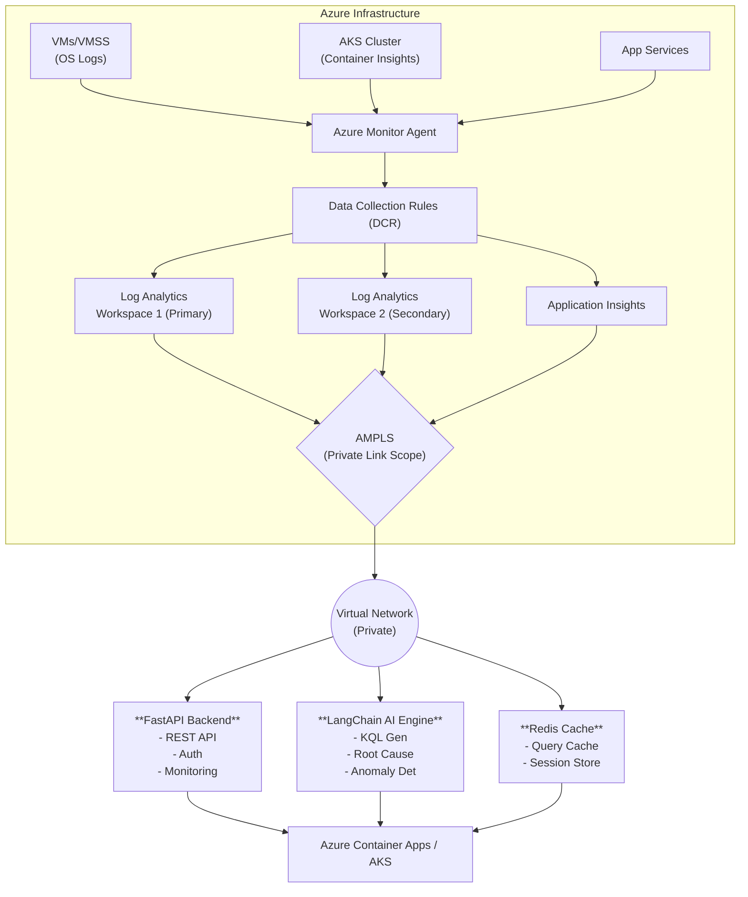

# 🏛️ Architecture & Design Guide: AI-Powered Azure Log Analytics

> **Project Info:** This document defines the enterprise-grade architecture, data flows, and security protocols for the AI-Powered Azure Log Analytics solution. It is designed for infrastructure teams, cloud architects, and security officers to understand the system topology and operational boundaries.

---

## 📑 Table of Contents
1. [Overview](#-overview)
2. [High-Level Architecture](#-high-level-architecture)
3. [Component Definitions](#-component-definitions)
4. [Data & Process Flows](#-data--process-flows)
5. [Security Architecture](#-security-architecture)
6. [Scalability & Reliability](#-scalability--reliability)
7. [Cost Optimization](#-cost-optimization)
8. [Compliance Frameworks](#-compliance-frameworks)
9. [Operational Best Practices](#-operational-best-practices)

---

## 🌐 Overview
The AI-Powered Azure Log Analytics solution is engineered for robust, scalable, and secure log monitoring across a distributed Azure infrastructure. By integrating Large Language Models (LLMs) and Machine Learning (ML) directly into the telemetry pipeline, it provides automated anomaly detection, natural language querying, and predictive incident analysis.

---

## 🏗️ High-Level Architecture


---

## 🧩 Component Definitions

### 1. Data Collection Layer
This layer is responsible for gathering raw telemetry data across diverse compute resources and standardizing it for ingestion.

* **Azure Monitor Agent (AMA)**
  * **Purpose**: Collect logs from VMs, VMSS, and on-premises servers.
  * **Protocols**: Windows (Event Logs, Perf Counters), Linux (Syslog, Perf Metrics).
  * **Routing**: Managed via Data Collection Rules (DCR).
* **Container Insights**
  * **Purpose**: Kubernetes and AKS cluster monitoring.
  * **Collects**: Pod logs (`stdout`/`stderr`), container metrics, cluster events, and node performance.
* **Diagnostic Settings**
  * **Purpose**: Native Azure resource telemetry.
  * **Sources**: Activity Logs, Resource Logs, Platform Metrics.

### 2. Data Storage Layer
The centralized repository for short-term analysis and long-term compliance storage.

* **Log Analytics Workspaces (LAW)**
  * **Structure**: Primary Workspace for active data; optional Secondary Workspace for geo-redundant disaster recovery.
  * **Retention**: Configurable between 30 and 730 days.
  * **Key Tables**: `Event`, `Syslog`, `Perf`, `ContainerLog`, `KubePodInventory`, `AzureActivity`.
* **Storage Accounts**
  * **Purpose**: Long-term archival and cost-optimized data lifecycle management.
  * **Lifecycle Tiers**: Hot (0-30 days), Cool (30-90 days), Archive (90+ days).

### 3. Network Security Layer
Ensures all telemetry traffic remains completely isolated from the public internet.

* **AMPLS (Azure Monitor Private Link Scope)**
  * **Purpose**: Private endpoint connectivity to Azure Monitor ecosystems.
  * **Benefits**: No public exposure, strict network isolation compliance, and secure query execution.
* **Private DNS Zones**
  * Required zones for proper AMPLS resolution:
    * `privatelink.monitor.azure.com`
    * `privatelink.oms.opinsights.azure.com`
    * `privatelink.ods.opinsights.azure.com`
    * `privatelink.agentsvc.azure-automation.net`
    * `privatelink.blob.core.windows.net`

### 4. AI & Machine Learning Layer
The intelligence engine that translates data into actionable insights.

* **LangChain Integration**
  * **Models**: `Mistral-7B-Instruct` (served via HuggingFace).
  * **Capabilities**: Natural language to KQL generation, automated root cause analysis, anomaly explanation.
* **ML Analytics Models**
  * **Anomaly Detection**: Isolation Forest combined with statistical baselining.
  * **Pattern Recognition**: Sentence Transformers combined with DBSCAN clustering for log categorization.
  * **Predictive Incident Analysis**: Time-series forecasting for capacity and failure trends.

### 5. Application Layer
The service interfaces that expose data and AI capabilities to end-users and client applications.

* **FastAPI Backend Services**
  * **Core Endpoints**: `/api/v1/logs`, `/api/v1/analytics`, `/api/v1/workspaces`, `/api/v1/compliance`.
* **Caching Strategy**
  * **Redis**: Query result caching (5-minute TTL to reduce repetitive LAW hits).
  * **In-Memory**: Workspace metadata (15-minute TTL).
* **Identity & Auth**
  * **Users**: Azure AD (OAuth 2.0 / OpenID Connect).
  * **Service-to-Service**: Azure Managed Identities.
  * **External integrations**: Managed API Keys (Optional).

---

## 🔄 Data & Process Flows

### 1. Log Ingestion Pipeline
```text
Compute Target (VM/AKS) → Azure Monitor Agent → DCR Filters → AMPLS → Log Analytics Workspace → Archive Storage
```

### 2. Standard Query Flow
```text
User Request → API Gateway → FastAPI → Cache Check (Miss) → Azure Monitor API → AMPLS → LAW → Response → Cache Update → User
```

### 3. AI Intelligence Flow
```text
User Natural Language Prompt → LangChain Agent → Prompt Engineering + Context → KQL Query Generated → LAW Execution → Results Parsed → ML Model Processing → Human-Readable Insight → User
```

---

## 🛡️ Security Architecture

> **Security Posture:** This system implements a Zero-Trust architecture. Explicit verification, least-privilege access, and assume-breach methodologies are applied at every layer.

* **Identity & Access Management (IAM):**
  * Strict RBAC definitions.
  * Azure AD SSO for human identities.
  * System-assigned Managed Identities for compute workloads.
  * Azure Key Vault for all application secrets.
* **Network Isolation:**
  * No public ingress endpoints.
  * All PaaS services secured via Azure Private Link / VNet Integration.
  * Explicit Deny-All Network Security Groups (NSGs).
* **Data Protection:**
  * **In-Transit**: TLS 1.2+ mandatory across all connections.
  * **At-Rest**: Azure Storage Service Encryption (SSE) using platform-managed keys (PMK).
  * **Privacy**: Automated PII masking for sensitive log outputs.
  * **Audit**: Complete immutable audit logging for all API interactions.

---

## 📈 Scalability & Reliability

### Scalability Strategy
* **Compute (App Layer)**: Azure Container Apps configured for auto-scaling (1-10 replicas based on CPU/HTTP load).
* **Compute (AKS Layer)**: Horizontal Pod Autoscaler (HPA) and Cluster Autoscaler enabled.
* **Database (Logs)**: Azure Log Analytics natively handles ingestion auto-scaling.

### Disaster Recovery (DR) & Reliability
* **RTO (Recovery Time Objective):** 1 Hour
* **RPO (Recovery Point Objective):** 5 Minutes
* **Backup Mechanisms:**
  * Workspace data replicated via Geo-redundant storage.
  * IaC state files secured in cross-region blob storage.
  * ML models snapshotted to blob storage prior to retraining.

### Observability
* Prometheus metrics natively exposed.
* Application Insights integrated for deep code-level tracing.
* **Critical Alerts:**
  * HTTP 5xx Error Rate > 5%
  * API P95 Latency > 2000ms
  * Availability drop < 99.9%

---

## 💰 Cost Optimization

> **Financial Governance:** Proactive cost management is built into the architecture to prevent budget overruns from high-volume ingestion.

### Cost Control Strategies
1. **Capacity Reservations**: Utilize 100GB/day commitment tiers for a ~30% cost reduction.
2. **Intelligent Ingestion**: Apply DCRs to sample or drop noisy, low-value telemetry before it hits the workspace.
3. **Data Lifecycle**: Aggressively move logs older than 30 days to Cool/Archive storage.
4. **Compute Savings**: Utilize Azure Reserved Instances for stable AKS nodes.

### Estimated Monthly Run Rate (Production)
| Service | Estimated Cost (USD) | Notes |
| :--- | :--- | :--- |
| Log Analytics | $50 - $100 | Assuming 100GB/day commitment |
| Container Apps | $20 - $30 | Auto-scaled execution |
| Storage Accounts | $10 - $15 | Blob / Archive storage |
| AKS Cluster | $150 - $200 | App hosting / CI processing |
| **Total Target** | **~$230 - $345** | *Subject to exact ingestion volumes* |

---

## 📜 Compliance Frameworks

The architecture is designed to support the following regulatory frameworks natively:

* **GDPR (Global)**: Enforces data retention controls, supports right to erasure, data portability, and maintains immutable access logs.
* **PDPA (Singapore)**: Facilitates consent management, supports strict data breach notification requirements, and enforces cross-border data transfer controls.
* **MAS (Singapore Financial)**: Aligns with TRM (Technology Risk Management) guidelines, supporting robust incident management, controlled change management, and strict cyber hygiene audit trails.

---

## 💡 Operational Best Practices

### Kusto Query Language (KQL) Optimization
1. **Always bound queries** by `TimeGenerated` to prevent full table scans.
2. **Filter early** using `where` clauses before executing complex joins.
3. Utilize `summarize` for aggregations rather than pulling raw row data.
4. Cap exploratory query result sets using the `top` operator.
5. Explicitly select required columns using `project` to reduce payload size.

### General DevOps & SecOps
1. **Infrastructure as Code**: All infrastructure changes must be driven through Terraform. No manual portal clicks.
2. **GitOps**: Leverage GitHub Actions for all deployments.
3. **Least Privilege**: Regularly review and prune RBAC assignments.
4. **Secret Rotation**: Automate credential and certificate rotation within Key Vault.