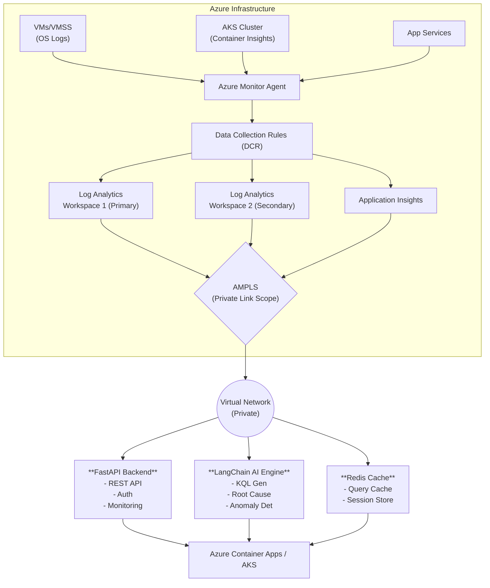

# Architecture Guide

## Overview

The AI-Powered Azure Log Analytics solution is designed for enterprise-grade log monitoring and analysis across Azure infrastructure.

## High-Level Architecture

### 🏗️ Architecture

## Components

### 1. Data Collection Layer

#### Azure Monitor Agent (AMA)
- **Purpose**: Collect logs from VMs, VMSS, and on-premises servers
- **Protocols**: 
  - Windows: Event Logs, Performance Counters
  - Linux: Syslog, Performance Metrics
- **Configuration**: Data Collection Rules (DCR)

#### Container Insights
- **Purpose**: Kubernetes/AKS monitoring
- **Collects**:
  - Pod logs (stdout/stderr)
  - Container metrics
  - Cluster events
  - Node performance

#### Diagnostic Settings
- **Purpose**: Azure resource logs
- **Sources**:
  - Activity Logs
  - Resource Logs
  - Platform Metrics

### 2. Data Storage Layer

#### Log Analytics Workspaces
- **Primary Workspace**: Main data repository
- **Secondary Workspace**: Geo-redundant backup (optional)
- **Retention**: 30-730 days configurable
- **Tables**:
  - `Event` - Windows events
  - `Syslog` - Linux syslog
  - `Perf` - Performance counters
  - `ContainerLog` - Container logs
  - `KubePodInventory` - Kubernetes metadata
  - `AzureActivity` - Activity logs
  - Custom tables

#### Storage Account
- **Purpose**: Long-term archival
- **Lifecycle**:
  - Hot: 0-30 days
  - Cool: 30-90 days
  - Archive: 90+ days

### 3. Network Security Layer

#### AMPLS (Azure Monitor Private Link Scope)
- **Purpose**: Private connectivity to Azure Monitor
- **Benefits**:
  - No public internet exposure
  - Data ingestion over private link
  - Query execution over private network
  - Compliance with network isolation requirements

#### Private DNS Zones
Required zones:
- `privatelink.monitor.azure.com`
- `privatelink.oms.opinsights.azure.com`
- `privatelink.ods.opinsights.azure.com`
- `privatelink.agentsvc.azure-automation.net`
- `privatelink.blob.core.windows.net`

### 4. AI/ML Layer

#### LangChain Integration
- **Models**: Mistral-7B-Instruct via HuggingFace
- **Capabilities**:
  - Natural language to KQL conversion
  - Root cause analysis
  - Anomaly explanation
  - Pattern insights

#### ML Models
- **Anomaly Detection**: Isolation Forest + Statistical methods
- **Pattern Recognition**: Sentence Transformers + DBSCAN clustering
- **Incident Prediction**: Time series analysis + trend detection

### 5. Application Layer

#### FastAPI Backend
- **Endpoints**:
  - `/api/v1/logs` - Log querying
  - `/api/v1/analytics` - AI analytics
  - `/api/v1/workspaces` - Workspace management
  - `/api/v1/compliance` - Compliance reports

#### Caching Strategy
- **Redis**: Query result caching (5 min TTL)
- **In-Memory**: Workspace metadata (15 min TTL)

#### Authentication
- **Azure AD**: OAuth 2.0 / OpenID Connect
- **Managed Identity**: Service-to-service auth
- **API Keys**: Optional for external integrations

## Data Flow

### 1. Log Ingestion Flow

VM/Container → Azure Monitor Agent → DCR → AMPLS → Log Analytics Workspace → Storage (Archive)

### 2. Query Flow

User → API Gateway → FastAPI → Azure Monitor Client → AMPLS → Log Analytics → Response → Cache → User

### 3. AI Analysis Flow

User Query → KQL Generator (LLM) → KQL Query → Log Analytics → Results → ML Model → AI Insights → User

## Security Architecture

### Identity & Access
- **Azure AD Integration**: SSO for users
- **Managed Identity**: For Azure resource access
- **RBAC**: Role-based access control
- **Key Vault**: Secrets management

### Network Security
- **Private Link**: No public endpoints
- **NSG**: Network security groups
- **VNet Integration**: Isolated network
- **TLS 1.2+**: Encryption in transit

### Data Security
- **Encryption at Rest**: Azure Storage SSE
- **Encryption in Transit**: HTTPS/TLS
- **Data Masking**: PII detection and masking
- **Audit Logging**: All access logged

## Scalability

### Horizontal Scaling
- **Container Apps**: Auto-scale 1-10 replicas
- **AKS**: HPA (Horizontal Pod Autoscaler)
- **Log Analytics**: Auto-scales for ingestion

### Performance Optimization
- **Query Optimization**: KQL best practices
- **Caching**: Redis for frequent queries
- **Sampling**: For high-volume logs
- **Aggregation**: Pre-computed metrics

## Disaster Recovery

### Backup Strategy
- **Workspace Backup**: Geo-redundant storage
- **Configuration Backup**: Terraform state in Azure Storage
- **Model Backup**: ML models in blob storage

### Recovery Objectives
- **RTO (Recovery Time Objective)**: 1 hour
- **RPO (Recovery Point Objective)**: 5 minutes
- **Data Retention**: 90 days minimum

## Monitoring & Observability

### Self-Monitoring
- API monitors itself in Log Analytics
- Prometheus metrics exposed
- Health check endpoints
- Application Insights integration

### Alerts
- **Error Rate**: >5% triggers alert
- **Latency**: >2s P95 triggers alert
- **Availability**: <99.9% triggers alert

## Cost Optimization

### Strategies
1. **Capacity Reservation**: 100GB/day commitment (-30% cost)
2. **Data Sampling**: Sample high-volume logs
3. **Retention Policies**: Move old data to cool/archive
4. **Query Optimization**: Efficient KQL queries
5. **Reserved Instances**: For compute resources

### Cost Breakdown (Production)
- Log Analytics: \$50-100/month (100GB/day)
- Container Apps: \$20-30/month
- Storage: \$10-15/month
- AKS: \$150-200/month
- **Total**: ~\$230-345/month

## Compliance Features

### GDPR
- Data retention controls
- Right to erasure
- Data portability
- Access logging

### PDPA (Singapore)
- Consent management
- Data breach notification
- Cross-border transfer controls
- Security measures

### MAS (Singapore Financial)
- Technology risk management
- Incident management
- Change management
- Audit trail
- Cyber hygiene

## Best Practices

### KQL Queries
1. Always use time filters
2. Filter early in the query
3. Use `summarize` for aggregations
4. Limit result sets with `top`
5. Use `project` to select columns

### Security
1. Use Managed Identity where possible
2. Rotate secrets regularly
3. Implement least privilege access
4. Enable audit logging
5. Regular security reviews

### Performance
1. Cache frequent queries
2. Use query templates
3. Optimize KQL queries
4. Monitor query performance
5. Set appropriate retention

### Operations
1. Infrastructure as Code (Terraform)
2. GitOps for deployments
3. Automated testing
4. Monitoring and alerting
5. Documentation
